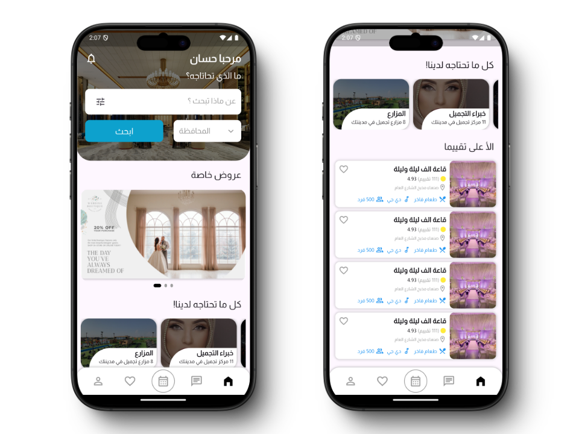
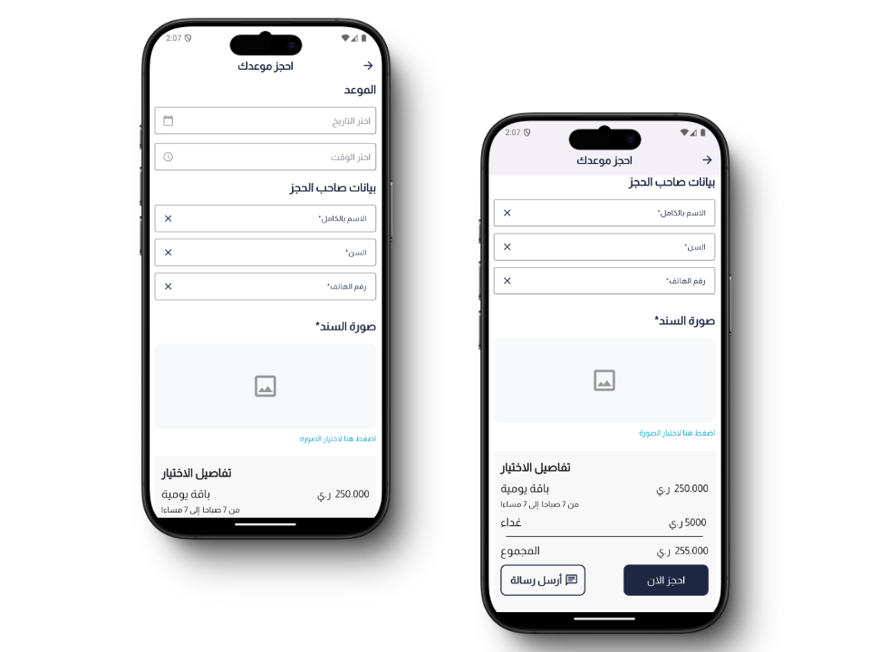
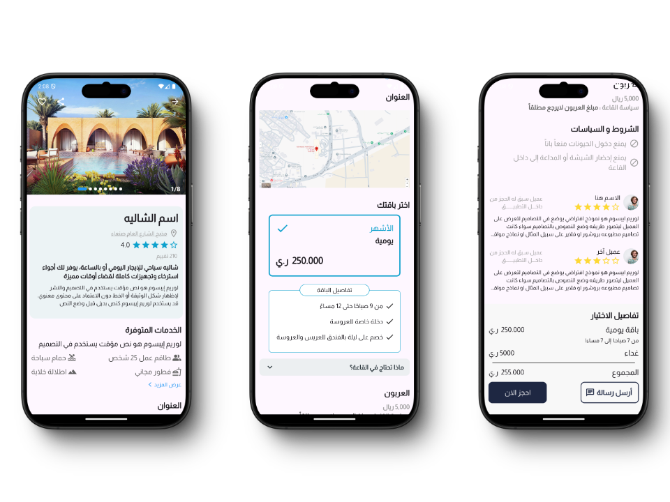
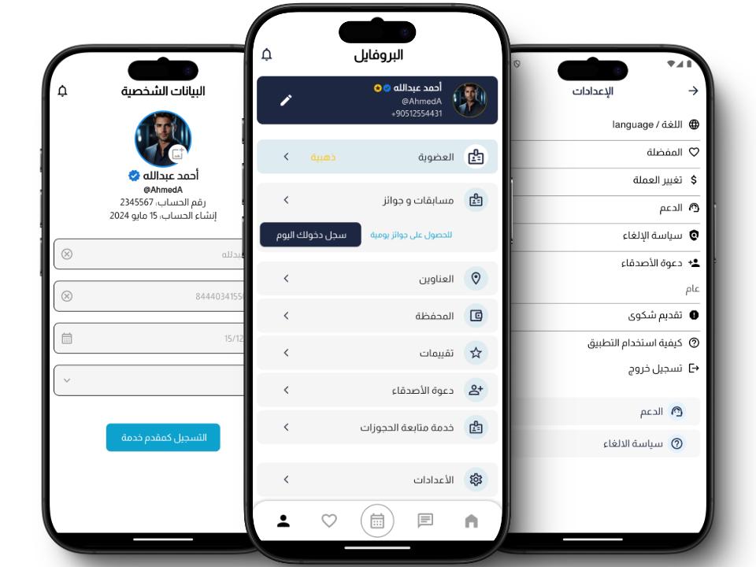
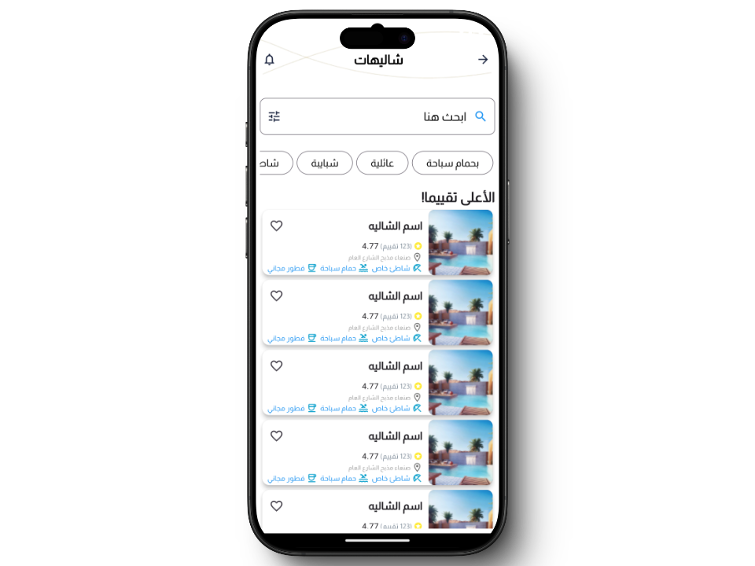

# Booking App

A Flutter application for managing bookings, designed to provide users with a simple and intuitive interface to make reservations quickly and efficiently.

## Features

- Browse available services and categories
- Book appointments easily
- Manage previous bookings

## Screenshots

### Home Screen

### Appointment Booking Screen

### Confirmation Screen

### Details Screen

### Profile Screen

### Category Screen

## Getting Started

This project is a starting point for a Flutter application.

A few resources to get you started if this is your first Flutter project:

- [Lab: Write your first Flutter app](https://docs.flutter.dev/get-started/codelab)
- [Cookbook: Useful Flutter samples](https://docs.flutter.dev/cookbook)

For additional help with Flutter development, refer to the [online documentation](https://docs.flutter.dev/), which offers tutorials, samples, guidance on mobile development, and a full API reference.
